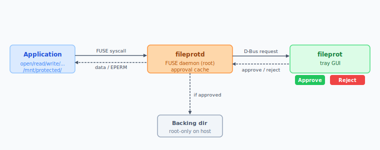

# fileprot

Simple file protection utility for Linux.

fileprot mounts one or more FUSE filesystems that intercept every file access.
When an application tries to read, write, create, delete, rename, change attributes of, or make a directory in a protected mount, the operation is blocked until the user explicitly approves or rejects it through a desktop tray application.

## Basic idea of operation

Whenever the fileprot approval dialog pops up and the user didn't do an operation that requires approval, then this is a sign of a malicious program trying to access your files.
In this case, the user must reject the request and investigate the requesting process further.

The idea is to **mitigate** the effects of **malware** on your system by establishing another barrier for the most valuable files on your system.

## Example: Protect SSH private keys

To put your ssh keys under fileprot protection, mount a fileprot FUSE filesystem at `~/.ssh`, or mount it somewhere else and make symlinks from the private key files to the FUSE mount.

Whenever you use ssh, the ssh client will try to read your private key file.
This will trigger a fileprot request, and open the approval dialog showing the ssh client's PID, executable path, and the accessed file path.

## What to put under fileprot protection?

1) Do not overdo it.
   Only put files under fileprot protection, that are really sensitive.
   Otherwise the overwhelming number of requests will lead to prompt fatigue and the user will just approve everything without thinking.
2) Restrict yourself to protecting things like: Private keys, password databases, sensitive documents like your bank account statements, or other private family data.
3) You can create multiple fileprot mounts for different purposes and different access policies.

## Architecture



## Components

| Binary | Purpose |
|--------|---------|
| `fileprotd` | FUSE daemon, runs as root, managed by systemd |
| `fileprot` | Desktop tray GUI for approving/rejecting requests |

## How It Works

1. `fileprotd` mounts one or more FUSE filesystems at configured mountpoints.
1. Files inside those mounts are stored in a backing directory on the host filesystem.
   The directory hierarchy mirrors the FUSE mount one-to-one.
   The backing directory is protected by standard Linux permissions.
   Only root can access it.
1. When a process accesses a file (read, write, create, delete, rename, mkdir, setattr), the FUSE driver blocks the operation and sends a request to the daemon.
1. The daemon forwards the request over D-Bus to the `fileprot` GUI.
1. The GUI shows the requesting process's PID, executable name, file path, and operation type.
1. The user clicks Approve or Reject. The FUSE operation resumes or fails accordingly.

Listing directory contents (`readdir`) does not require approval.

### Approval Caching

To avoid repeated prompts for the same process, the daemon can cache approvals.
A cached approval is keyed on the process's PID, UID, executable path, and start time read from `/proc/<pid>/stat`.
This prevents PID reuse from bypassing the cache.
Caching behavior is configurable and it is also possible to disable caching entirely.

### D-Bus Communication

The daemon exposes the `ch.bues.fileprot.AccessControl` interface on the system bus at bus name `ch.bues.fileprot.Daemon`, object path `/ch/bues/fileprot/Daemon`.
The GUI fetches outstanding requests and approves or rejects them. 

Before processing a response, the daemon verifies that the calling peer's executable matches the configured `gui_binary_path`, so only the legitimate `fileprot` binary can approve or reject requests.

## Installation

See [INSTALL.md](INSTALL.md) for the full step-by-step installation guide.

### Running the GUI

Run the GUI tray application as your desktop user:

```bash
/opt/fileprot/bin/fileprot
```

The GUI will appear as a tray icon. When an application tries to access a
protected file, a request will appear in the GUI window showing:

- **PID** - process ID of the requesting application
- **File path** - the protected file being accessed
- **Application** - the executable path of the requesting application
- **Operation** - read, write, create, delete, rename, mkdir, or setattr

Click **Approve** to allow the operation or **Deny** to block it.

If no response is given within the configured timeout (default: 30 seconds),
the request is automatically denied.

## Configuration

The configuration file is at `/opt/fileprot/etc/fileprot/fileprotd.conf`.
See [fileprotd.conf.example](fileprotd.conf.example) for the full annotated example.

## License

This application is AI generated with heavy manual modifications by
**Michael Büsch** <m@bues.ch>

Licensed under the Apache License version 2.0 or alternatively MIT or alternatively feel free to do whatever you want with this software without restriction.

If you want to redistribute this software in a modified form, I would like to ask you kindly to remove my name from the source code, the documentation, the build scripts and any other files beforehand.
